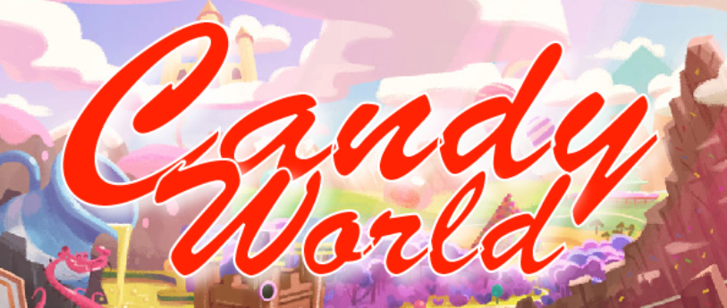
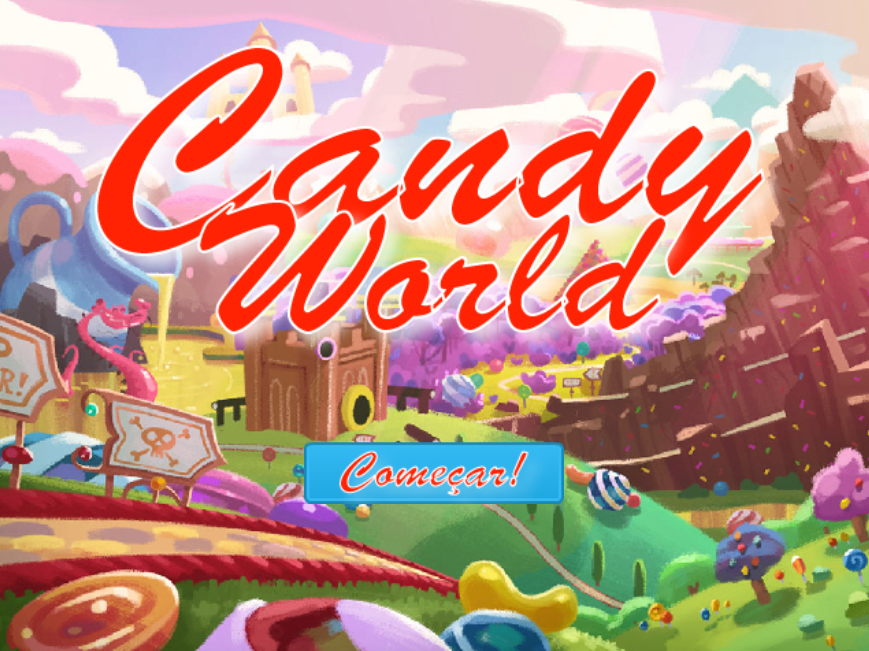
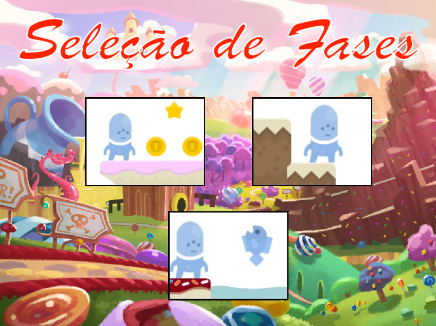
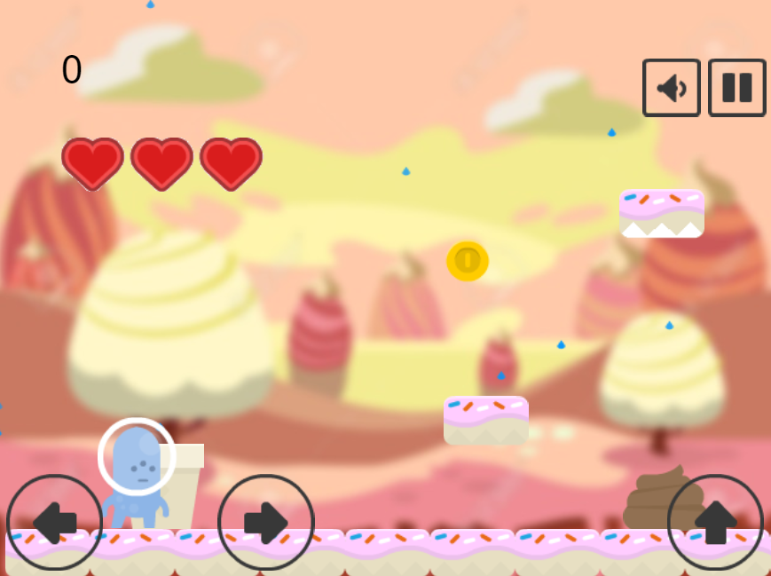
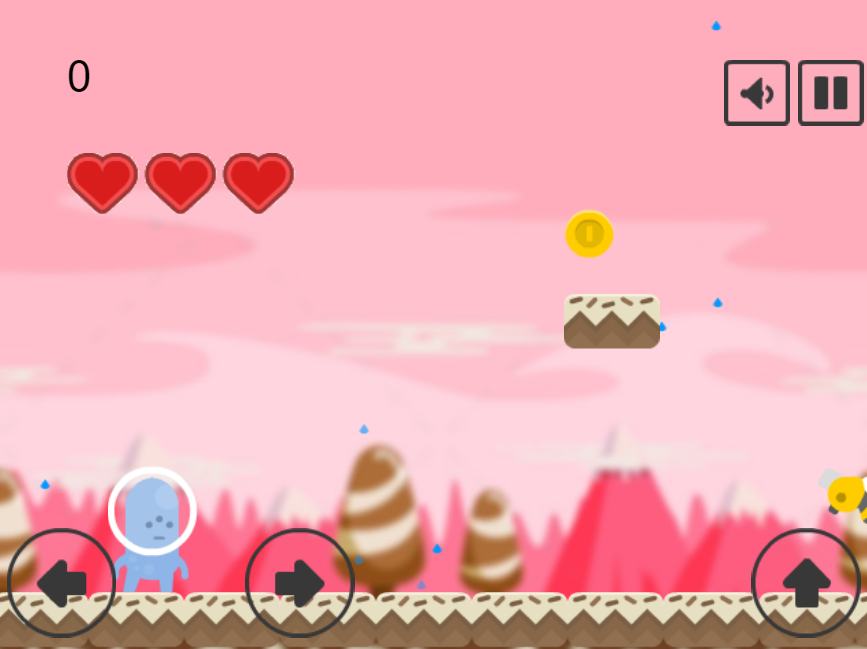
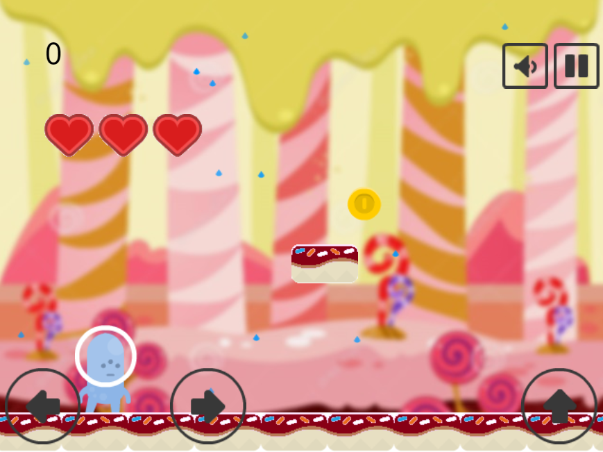
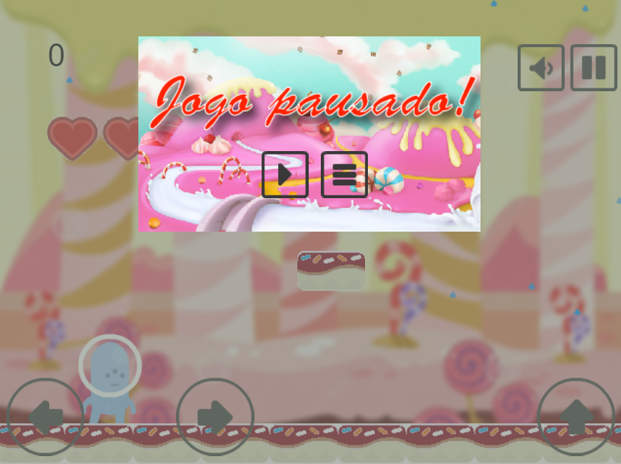
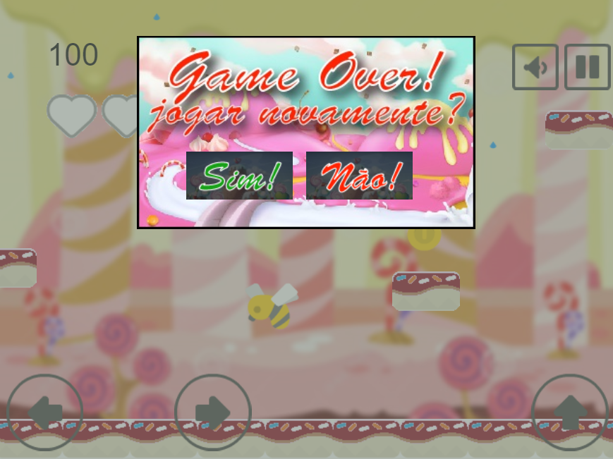
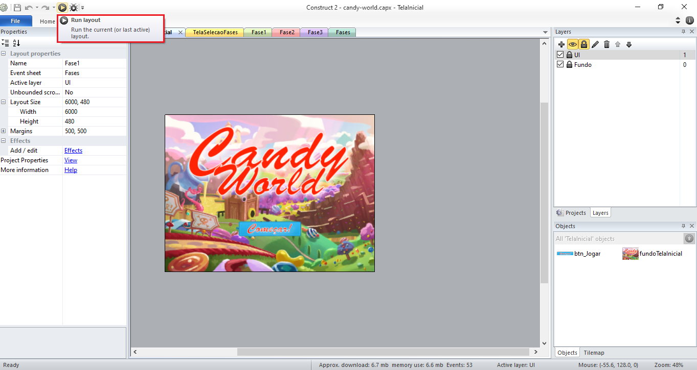
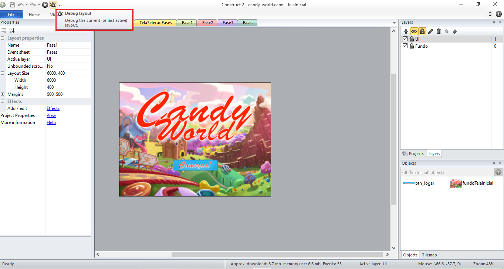

# Candy World

<br />
<p align="center">
  <a href="https://github.com/lucas-castro-developer/candy-world">
    
  </a>

  <h3 align="center">Candy World</h3>

  <p align="center">
    Ajude nosso amigo cabeçudo a encontrar as chaves premiadas e encher seu cofrinho de moedas
    <br />
    <a href="https://github.com/lucas-castro-developer/candy-world"><strong>Explore as documentações »</strong></a>
    <br />
    <br />
  </p>
</p>

<details open="open">
  <summary>Conteúdos</summary>
  <ol>
    <li>
      <a href="#sobre-o-projeto">Sobre o projeto</a>
      <ul>
        <li><a href="#construído-com">Construído com</a></li>
      </ul>
    </li>
    <li>
      <a href="#iniciando">Iniciando</a>
      <ul>
        <li><a href="#pré-requisitos">Pré-requisitos</a></li>
        <li><a href="#instalação">Instalação</a></li>
      </ul>
    </li>
    <li><a href="#Contribuição">Contribuição</a></li>
    <li><a href="#Licença">Licença</a></li>
    <li><a href="#Contato">Contato</a></li>
  </ol>
</details>

## Sobre o projeto

O projeto `Candy World` desenvolvido durante a leitura do livro "Construct 2: crie seu primeiro jogo multiplataforma", dos autoras Bruna Escudelario e Diego Pinho e consiste em um game de plataforma onde nosso personagem deve percorrer os mais diversos cenários, enfrentando inimigos mortais e capturando itens especiais como moedas e estrelas e chegar até o final do trajeto com sua chave especial para vencer.

O jogo possui três fases e todas elas estão liberadas para que o jogador possa se aventurar livremente.

O projeto possui sete telas principais: a tela inicial, tela de seleção de fases, os layouts das fases 1, 2 e 3, e as telas de Pausa e Game Over.

- Tela Inicial



- Tela da seleção de fases



- Fase 1



- Fase 2



- Fase 3



- Tela de pausa



- Tela de Game Over



### Construído com

Este projeto foi construído com o auxílio da seguinte ferramenta
* [Construct 2](https://construct-2.br.uptodown.com/windows)

<!-- GETTING STARTED -->
## Iniciando

Para começar a manipular o projeto, siga os passos abaixo:

### Pré-requisitos

O único pré-requisito do projeto é ter o Construct 2 instalado localmente ou em sua versão portable.

### Instalação

1. Clone o repositório
 ```sh
 git clone https://github.com/lucas-castro-developer/candy-world.git
 ```

2. Clique duas vezes no arquivo `candy-world.capx`, na raiz do projeto, e o Construct 2 será aberto:

3. Para rodar o projeto, clique na botão `Run Layout`:



4. Caso queira rodar no modo debug, clique no botão `Debug Layout`:



Seu navegador de preferência será aberto e o jogo será iniciado pelo navegador, geralmente no endereço `http://localhost:50000/`. Mas isso pode variar dependendo da configuração da sua máquina e/ou do projeto.

## Contribuição

Quer contribuir com este projeto? Então siga os passos abaixo:

1. Realize o fork do projeto
2. Crie sua branch (`git checkout -b feature/AmazingFeature`)
3. Faça o commit das suas modificações/criações (`git commit -m 'Add some AmazingFeature'`)
4. Publique a branch (`git push origin feature/AmazingFeature`)
5. Abra uma Pull Request

## Licença

Este projeto não utiliza nenhum tipo de licença.

## Contato

Lucas dos Santos Castro - [LinkedIn](https://www.linkedin.com/in/lucas-santos-castro-developer/) - lucascastrodeveloper@gmail.com

Project Link: [https://github.com/lucas-castro-developer/candy-world](https://github.com/lucas-castro-developer/candy-world)
